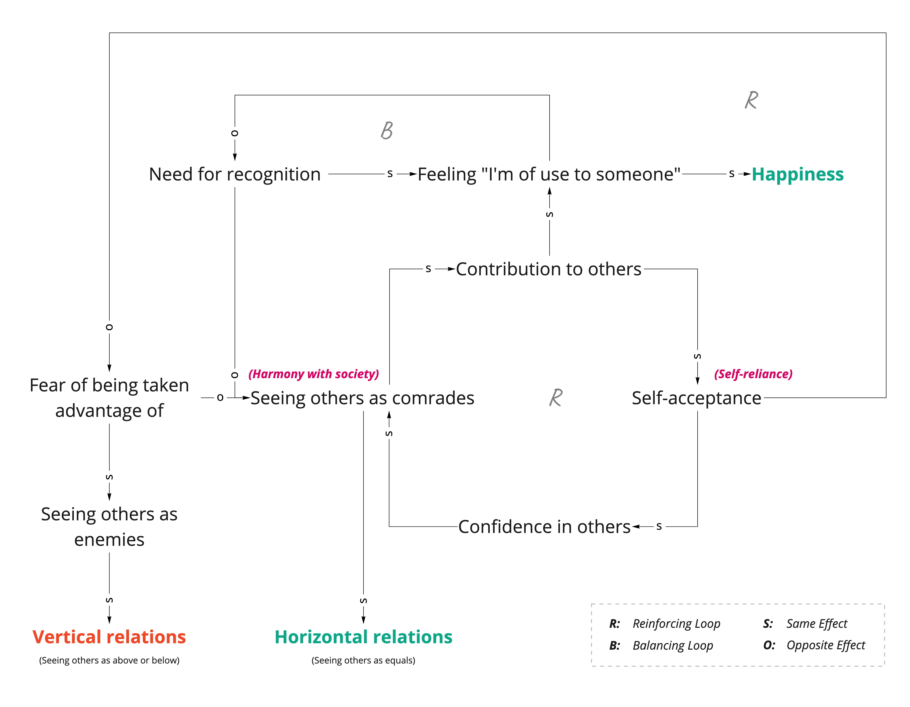

We feel happy when we feel [[self-worth|we are of use to someone]]. 

When we have low self-worth, that becomes difficult. We being to look for recognition to feel useful. Everything becomes about getting recognized. This desire makes life a competition and we start seeing others as enemies. 

This happens with family, friends, and coworkers. You can't feel happy about a friend's promotion. You treat others as competition so that you could look great in front of your boss. And you find motives behind a nice thing your cousin might have said. 

When others decide our value, our self-worth takes a big hit. It's a vicious cycle.

Alfred Adler said that all problems are interpersonal problems. The desire for recognition is an interpersonal problem too. It arises because we can't separate our tasks from other people's tasks. Most unhappiness arises because we try to do other people's tasks or let them interfere in ours. 

When conducting the separation of tasks, we need to first ask ourselves the following question:
>Who ultimately is going to receive the end result brought about by the choice that is made? <cite>Alfred Adler</cite>

The way the other person acts or feels is their task. 

Self-acceptance and therefore seeing others as comrades reduces the need for recognition. 

We can, therefore, feel happy without needing others to recognize us.

